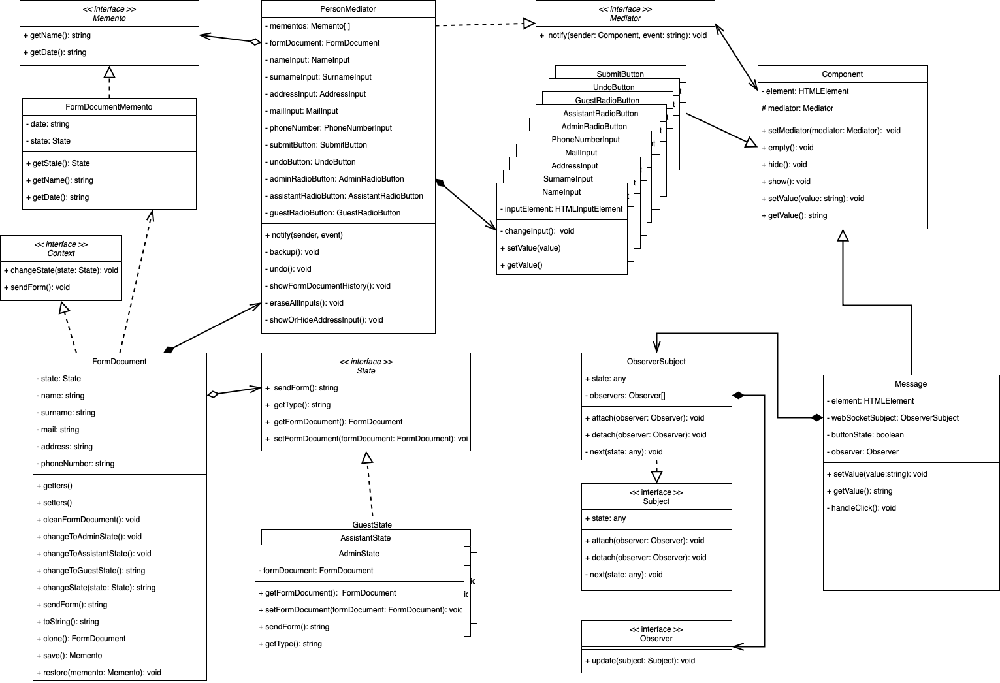

<h1 style="margin-bottom: 0" align="center">Návrhové vzory: Behavioral patterns</h1>
<h2 style="margin-top: 0" align="center">(Mediator, Observer, State, Memento)</h2>
<h3 style="margin: 0" align="center"><a href="">Prezentácia</a></h3>
<h3 style="margin-top: 0" align="center"><a href="">Dokumentácia</a></h3>

Na spustenie našej aplikácie je potrebné urobiť niekoľko krokov. Z nášho github repozitára si klonneme alebo stiahneme 
zdrojový kód lokálne do počítača.

Najdôležitejšia prerekvizita je stiahnutie a nainštalovanie Node. To môžeme urobiť cez inštalátor alebo zdrojový 
kód [tu](https://nodejs.org/en/download/) alebo cez package manager s príkazmi [tu](https://nodejs.org/en/download/). 
Vďaka inštalácii Node vieme používať package manager nazývaný npm.

Na naše návrhové vzory potrebujeme používať plnohodnotne triedy, kvôli čomu sme si zvolili používanie Typescript 
namiesto Javascript. Kvôli tomu potrebujeme nainštalovať Typescript v projekte, čo zabezpečujeme cez náš 
package.json, ktorý je súčasťou programu. Na inštalovanie všetkých dependencies vrátane Typescriptu je potrebné 
spustiť cez konzolu v priečinku so súborom package.json príkaz `npm install`.

Pre spustenie aplikácie je potrebné najprv spustiť Typescript kód pomocou príkazu cez konzolu `npx tsc`. 
Následne keď otvoríte HTML súbor, zobrazí sa vám naša webová aplikácia v zvolenom prehliadači na localhost-e, 
teda lokálne u vás v počítači.

<h2 style="text-align: center; margin-top: 0">UML class diagram aplikácie</h2>

    

